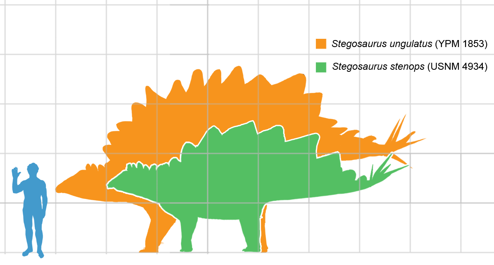

# Steganography Lib

[](http://godoc.org/github.com/auyer/steganography)
[](https://goreportcard.com/report/github.com/auyer/steganography)
[](https://img.shields.io/badge/license-MIT-brightgreen.svg)
[](https://circleci.com/gh/auyer/steganography)
[](https://codecov.io/gh/auyer/steganography)
[](https://github.com/avelino/awesome-go) 

Steganography is a library written in Pure go to allow simple LSB steganography on images. It is capable of both encoding and decoding images. It can store files of any format.
This library is inspired by [Stego by EthanWelsh](https://github.com/EthanWelsh/Stego), a command line utility with the same purpose.

## Installation
```go
go get -u github.com/auyer/steganography
```

## Demonstration

| Original              |Encoded           |
| -------------------- | ------------------|
|   | 

The second image contains the first paragaph of the description of a stegosaurus on [Wikipedia](https://en.wikipedia.org/wiki/Stegosaurus), also available in [examples/message.txt](https://raw.githubusercontent.com/auyer/steganography/master/examples/message.txt) as an example.

------
Getting Started
------
```go
package main
import (
    "bufio"
    "image/png"
    "io/ioutil"

    "github.com/auyer/steganography"
)
```

Encode
------
Write mode is used to take a message and embed it into an image file using LSB steganography in order to produce a secret image file that will contain your message.

Note that the minnimum image size is 24 pixels for one byte. For each additional byte, it is necessary 3 more pixels.

```go
inFile, _ := os.Open("input_file.png") // opening file
reader := bufio.NewReader(inFile)   // buffer reader 
img, _ := png.Decode(reader)   // decoding to golang's image.Image

w := new(bytes.Buffer)   // buffer that will recieve the results
err := steganography.Encode(w, img, []byte("message")) // Encode the message into the image
if err != nil {
    log.Printf("Error Encoding file %v", err)
    return
}
outFile, _ := os.Create("out_file.png") // create file
w.WriteTo(outFile) // write buffer to it
outFile.Close()
```
note: all error checks were removed for brevity, but they should be included.

Size of Message
------
Length mode can be used in order to preform a preliminary check on the carrier image in order to deduce how large of a file it can store.

```go
sizeOfMessage := steganography.GetMessageSizeFromImage(img) // retrieves the size of the encoded message
```

Decode
-----
Read mode is used to read an image that has been encoded using LSB steganography, and extract the hidden message from that image.

```go
inFile, _ := os.Open(encodedInputFile) // opening file
defer inFile.Close()

reader := bufio.NewReader(inFile) // buffer reader 
img, _ := png.Decode(reader) // decoding to golang's image.Image

sizeOfMessage := steganography.GetMessageSizeFromImage(img) // retrieving message size to decode in the next line

msg := steganography.Decode(sizeOfMessage, img) // decoding the message from the file
fmt.Println(string(msg))

```
note: all error checks were removed for brevity, but they should be included.

Complete Example
------
For a complete example, see the [examples/stego.go](examples/stego.go) file. It is a command line app based on the original fork of this repository, but modifid to use the Steganography library.

-----
### Attributions
 - Stegosaurus Picture By Matt Martyniuk - Own work, CC BY-SA 3.0, https://commons.wikimedia.org/w/index.php?curid=42215661
